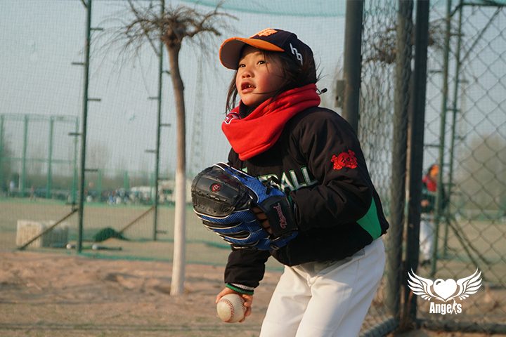
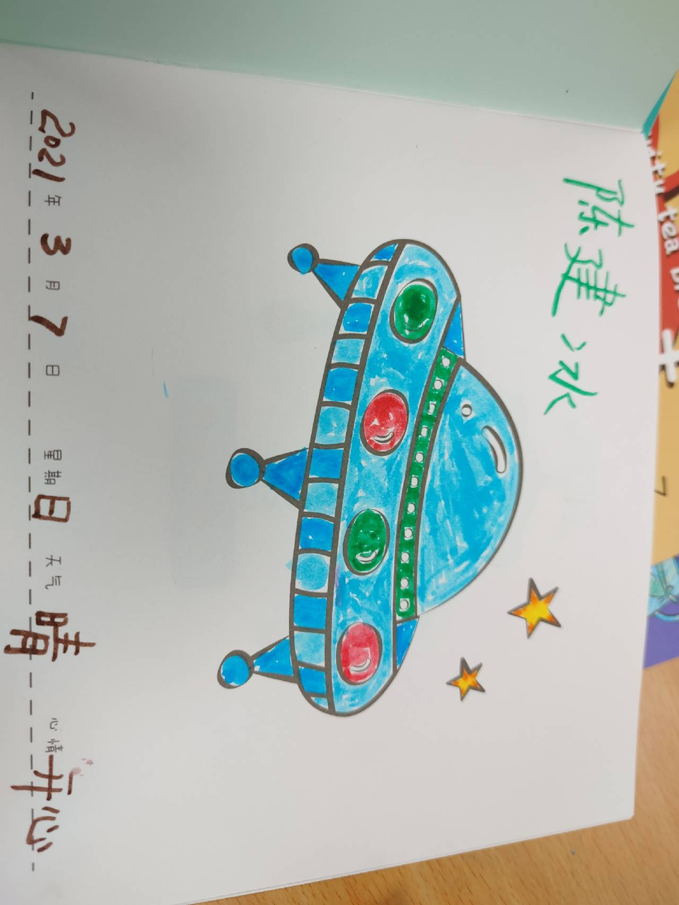
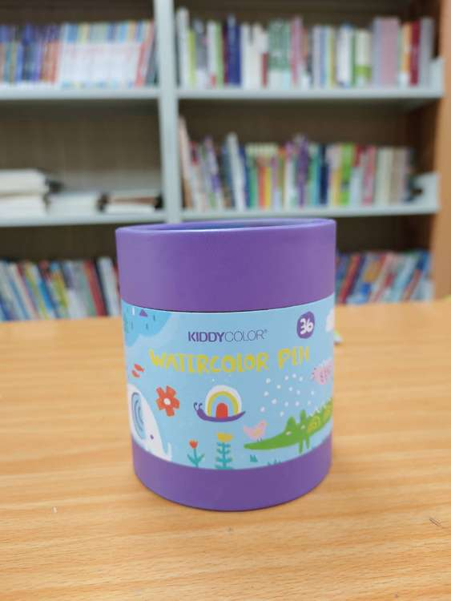
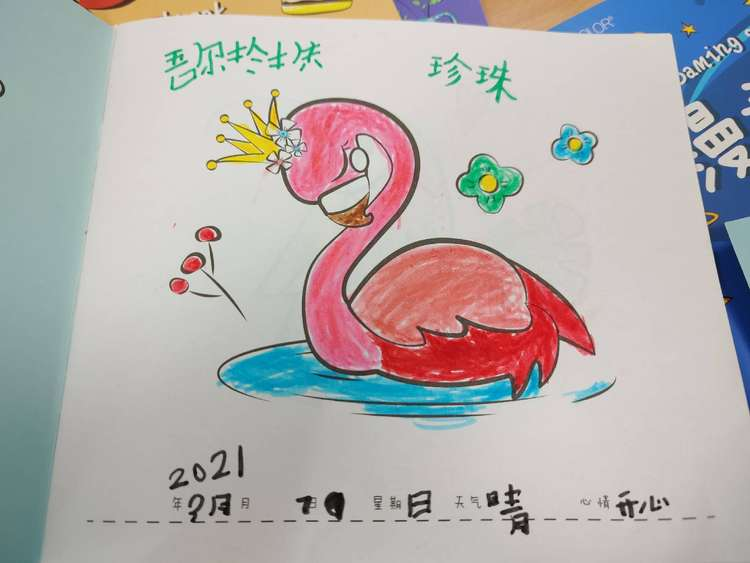
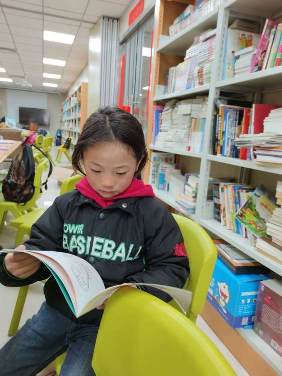

#### 大哥哥大姐姐们好，我叫吾尔珍珠。

我出生于2014.4.21，是去年(2020年)9月加入强棒基地的，我的老家在四川凉山州，我才6岁，小小的个子，很乖很懂事，大家说我的牙齿特别可爱，像从米老鼠那里偷来的。

> **我的兴趣爱好**

我挺喜欢画画，看画册也可以看很久。一位大哥哥陪我画了两张画我还保存了。

看到其他小朋友用抖音里的道具，我就也在手机里看自己头上扎辫子、办鬼脸，我特别开心。

我也非常喜欢拍照片，拍别人、拍自己都很喜欢。之前把一套大哥哥带给我的5本的画册每一页都逐个拍照片，后来他教我怎么把一张照片排正，于是拍了下面这个画笔筒。

运动起来特别活力，玩棒球、羽毛球的时候都不知道累。

> **我与棒球**

我是去年来到强棒基地开始学习棒球的。但是我还太小了，个头比球棒只高一点点，很多时候其实不能很好地掌控球棒，所以常常打不中球呀。但是我还是跟教练下午训练，训练的时间不长，
也不会觉得累，老师和同学们都一直鼓励我，我打得不好也从来没有人笑话我。所以我挺喜欢打棒球，一次次练习，尽管打中的次数不多，但是我会边学边练边长大，一定会越来越好的。

> **我的一天**

我每天上午会上文化课，数学老师教数学，语文老师教我们学汉语写汉字，现在我会写的汉字还不多，但是看到图片会说的挺多的。我知道汉堡、蜜蜂、飞碟、冰淇淋，一看到图片我立马就能说出来。
可惜我现在会写的汉字太少啦。才磕磕碰碰学会了写自己的名字，“哪儿”的“哪”字最难写。上次跟一位大哥哥玩得很开心，他教我写了“开心”两个字，还说以后开心的日子记日记，在心情那块，就可以写“开心”两个字。

老师们都很好，师爷爷告诉我我是金牛座。下午在训练场上遇到老师，我还会主动挥挥手打招呼。

> **我的愿望**

好好学习，写好汉字。也要多读书，将来长大了有能力了也要跟师爷爷和孙教练一样去帮助更多的人。

#### 这就是我啦，我叫吾尔珍珠，还很小，但很有活力，很懂礼貌，也很懂事，喜欢学习，希望自己每天开心，快快长大。
